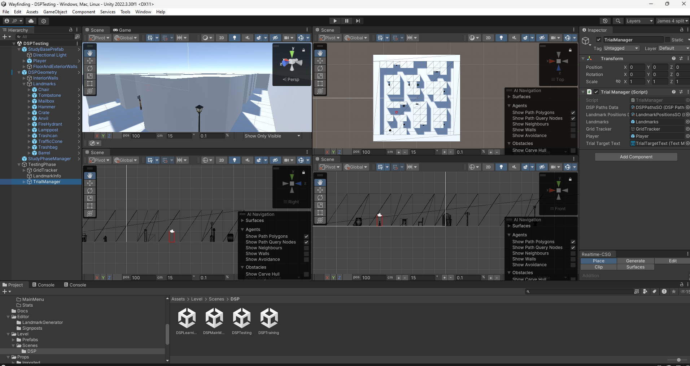

# Wayfinding Study Tool with the Dual Solution Paradigm

Made in `Unity 2022.3.30f1`

[](https://www.youtube.com/watch?v=utMFn1oeuIE)

## Overview

This Unity project is intended to be a tool for conducting wayfinding studies, with extinsibility in mind for future studies and parameter tweaks. Such a tool was previously not available online.

This project includes an implementation of the Dual Solution Paradigm (DSP), a framework commonly used in wayfinding studies to analyze how individuals navigate and find their way in different environments. Please see [Running a DSP Study](RunningADSPStudy.md) for more info.

## Features
- A fully working and usuable Dual Solution Paradigm Study implementation
- Stat collection for individual trials and studies as a whole
- An extensible codebase, in which new parameters and logic can be added in a modern and stable unity version.
- Generally, a framework from which future wayfinding studies can be ran from.

## Set up
1. [Install Unity ](https://unity.com/download)
2. Clone the repository:
    ```
    git clone https://github.com/jamespilcher/wayfinding-study-tool
    ```
3. Open the project in `Unity 2022.3.30f1` or later.

## Feature Requests and Issues

Feature requests should be raised as an [Issue](https://github.com/jamespilcher/wayfinding-study-tool/issues) and contain relevant on what needs to be added.

Unsurprisingly, issues should also be raised as an Issue.

You can also find my email on my profile.

## Custom Logic

If new logic is added to this project, it is preferable to [fork this repository](https://docs.github.com/en/pull-requests/collaborating-with-pull-requests/working-with-forks/about-forks#about-forks) and, if suitable, submit a pull request.

## Special thanks
Special thanks to [Cayley MacArthur](https://uwaterloo.ca/stratford-school-of-interaction-design-and-business/profiles/cayley-macarthur), [Mark Hancock](https://uwaterloo.ca/management-science-engineering/profile/m2hancoc), [Dahzhuang Teng](https://www.linkedin.com/in/dazhuang-teng-8b060824a/), [The Games Institute](https://uwaterloo.ca/games-institute/), and [Mitacs](https://www.mitacs.ca/) for facilitating this project.

