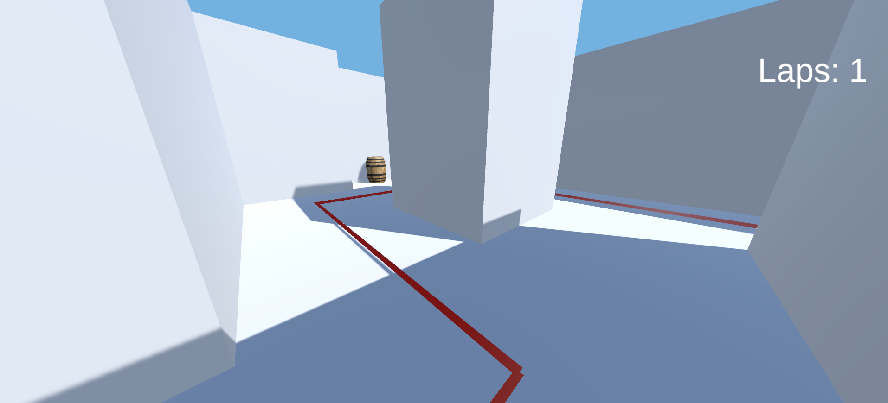

# Wayfinding Study Tool with the Dual Solution Paradigm

Made in `Unity 2022.3.30f1`


## Overview

This Unity project is intended to be a tool for conducting wayfinding studies, with extinsibility in mind for future studies.

This project includes an implementation of the Dual Solution Paradigm (DSP), a framework commonly used in wayfinding studies to analyze how individuals navigate and find their way in different environments. 

The 'Dual Solution' refers to having a solution that either takes a shortcut or follows a known route. This tool enables researchers to collect and analyze data on participants' navigation strategies and performance. The DSP has been utilized in the following studies:

- 
- 

Please see `Running a DSP Study` for more info

## Features

- Stat collection for individual trials and studies as a whole
- Extensibility for other studies and parameter tweaking.

## Installation

1. Clone the repository:
    ```sh
    git clone https://github.com/jamespilcher/wayfinding-study-tool
    ```
2. Open the project in `Unity 2022.3.30f1` or later.

## Running a DSP Study using this tool

1. **Setup**: Configure the study parameters in the `StudyConfig` script.
2. **Run the Study**: Start the Unity scene to begin the wayfinding study.
3. **Collect Data**: Data will be collected automatically during the study.
4. **Save Data**: Use the `SaveDataToFile` method to save the collected data to a CSV file.





[](https://www.youtube.com/watch?v=utMFn1oeuIE)


## Code Overview

### ManhattanPathing.cs

Handles the pathfinding logic and data collection for the participants' routes.

### DataCollector.cs

Manages the collection and saving of trial data.

### StudyConfig.cs

Contains configuration settings for the study.

## Example

```csharp
// Example of starting the data collection
ManhattanPathing manhattanPathing = new ManhattanPathing();
manhattanPathing.StartCoords(new Vector3(0, 0, 0));

// Example of updating coordinates
manhattanPathing.UpdateCoords(new Vector3(1, 0, 0));

// Example of saving data to file
DataCollector.SaveDataToFile();