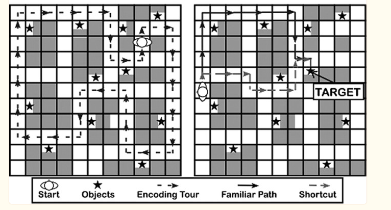
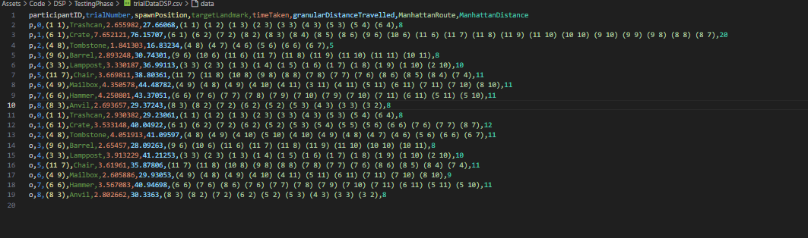

# Running A DSP Study

The 'Dual Solution' refers to having a solution that either takes a shortcut or follows a known route, which highlights two key approaches to navigation. The DSP concept was developed by Marchette, Bakker, and Shelton in [this 2011 study](https://www.ncbi.nlm.nih.gov/pmc/articles/PMC4826051/) has since been utilized in [numerous studies](https://scholar.google.ca/scholar?hl=en&as_sdt=0%2C5&q=%22dual+solution+paradigm%22&btnG=) focussing on navigation techniques.

The implementation in this repository is identical to the image presented above, and has therefore has room for implementing parameter tweaks. Preferably, if new logic is created, [a fork of this repo](https://docs.github.com/en/pull-requests/collaborating-with-pull-requests/working-with-forks/about-forks#about-forks) should be made - although this is not required.

Alternatively, if the independent variables don't require logic changes (I.E exist in real-life), you are ready to go!

## Set up:
1. As said before, if necessary, define any additional parameters in `StudyConfig.cs` and implement it's logic. Most often these additional parameters will be your **indepedent variables**. The parameters will then automatically be displayed in the `DSPMainMenu` scene. 
2. If disabling shadows (as shadows grant more localisation information) is desired: Edit -> Project Settings -> Quality -> Shadows -> Disable Shadows.
3. In `Assets/Code/DSP` There is a scriptable object called DSPPathsData for managing the DSP trials. This will define 1. the player spawn coordinates (based on a 13x13 grid system), and 2. the target landmark to navigate to. Configure this Scriptable Object in order to include trials which will test navigational strategy. The current values in the scriptable object should be used as an example.

## Running the study
A video can be found [here](https://www.youtube.com/watch?v=utMFn1oeuIE).

1. Run the `DSPMainMenu` Scene in `Assets/Level/Scenes/DSP` and configure parameters. The parameters are set to their default values, and therefore should be defined at runtime for each participant. For large scale studies, a script could be written to achieve this.
2. For each participant:
    - Define their participant ID and other parameters
    - Select Begin. This will load into the Training Scene.
    - Once Participant is happy with the controls, change scene to the Learning phase by pressing the number 9.
    - Do a set number of laps (typically 5) following the red line. At each landmark, the participant should familiarise themself with it. Once completed, change scene to the Testing phase by pressing the number 0.
    - The parcipant will complete all the trials listed in the `DSPPathsData` scriptable object. Once completed, all statistics for that participant will be collated and appended to a csv named `trialData\<StudyName\>.csv`

*Use the following KeyBindings to navigate to the correct phase of the study: 8->Training, 9->Learning, 0->TestingPhase.*

3. Once study is completed you will have a CSV located at `Assets/Code/DSP` containing the following fields:
- **participantID** - unique identifier for the participant
- **trialNumber** - incremented per trial per participant
- **spawnPosition** - what coordinates did the candidate spawn at, as defined in `DSPPathsData`
- **targetLandmark** - what was the target landmark, as defined in `DSPPathsData`,
- **timeTaken** time taken to find the landmark,
- **granularDistanceTravelled** - the absolute, real-world geometric distance taken,
- **ManhattanRoute** - which was route taken according to the grid system
- **ManhattanRouteDistance** - total length of this route.

### DSPMainMenu and parameters

### Training Phase 

### Learning Phase

### Testing Phase

### Example CSV Out

